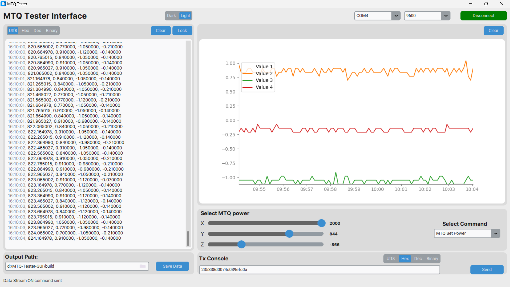
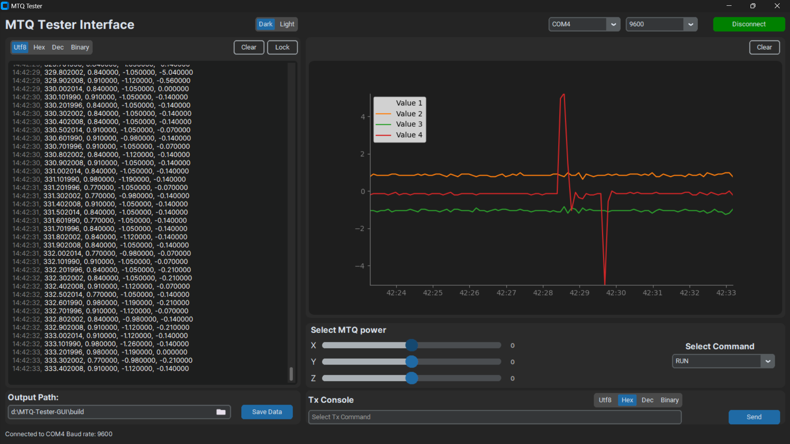

# MTQ Tester GUI

A Python-based GUI application for testing and controlling Magnetic Torque Rods (MTQ).

## Features

- Live data plotting
- MTQ power control sliders
- Data logging and export
- Dark/Light theme support

## UI Themes
### Light:

### Dark:
